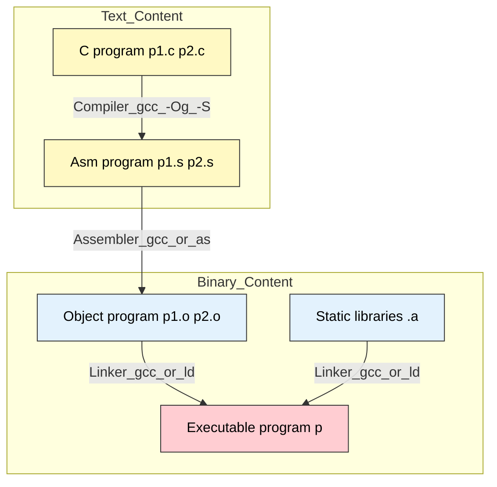

# Machine-Level Programming I: ~={yellow}Basics=~
课程的核心部分
机器代码有两个指代的对象：
- Object code (the binary form)
- Assembly code (the text version of it)
- 这两者==可互换==，因为它们的映射是==一对一==的
# History of Intel processors and architectures
## Intel x86 Processors
# C, assembly, machine code
## Turing C into Object Code
- Code in files `p1.c p2.c`
- Compile with command: `gcc -Og p1.c p2.c -o p`
	- Use basic optimizations(`-Og`)\[New to recent versions of GCC\]
	- Put resulting binary in file `p`

- 运行程序时，有一些库在程序首次开始时~={cyan}动态导入=~
### Compiling Into Assembly
#### C Code (sum.c)
```C
long plus(long x, long y);

void sumstore(long x, long y, long *dest) {
	long t = plus(x, y);
	*dest = t;
}
```
#### Generated x86-64 Assembly
```x86 Assembly
sumstore:
    pushq   %rbx
    movq    %rdx, %rbx
    call    plus
    movq    %rax, (%rbx)
    popq    %rbx
    ret
```
这些`%`就是寄存器的实际名称
- `push:`将东西推到栈上
- `mov:`将它从一个地方==复制==到另一个地方
- `call:`调用一些指令
- `pop: push`的对应指令
- `ret:`从一个特定的函数返回
### Command
`gcc -Og -S sum.c`
Produces file `sum.s`
### 完整版
```x86
.LFE34:
    .size   plus, .-plus
    .globl  sumstore
    .type   sumstore, @function
sumstore:
.LFB35:
    .cfi_startproc
    pushq   %rbx
    .cfi_def_cfa_offset 16
    .cfi_offset 3, -16
    movq    %rdx, %rbx
    call    plus
    movq    %rax, (%rbx)
    popq    %rbx
    .cfi_def_cfa_offset 8
    ret
    .cfi_endproc
.LFE35:
    .size   sumstore, .-sumstore
    .section    .rodata.str1.1,"aMS",@progbits,1
.LC0:
```
- 删掉用不到的部分提高可读性
## Assembly Characteristics
### Data Types
#### Integer data of 1, 2, 4, or 8 bytes
- Data values
- ==不区分signed和unsigned==
- Addresses (untyped pointers)
#### Floating point data of 4, 8, or 10 bytes
#### ~={pink}No aggregate types=~ such as arrays or structures
- Just contiguously allocated bytes in memory
### Operations
- 每条指令能做到的事情都非常有限
- Perform arithmetic function on register or memory data
- Transfer data between ~={orange}memory=~ and ~={purple}register=~
	- Load data from memory into register
	- Store register data into memory
- Transfer control
	- Unconditional jumps to/from procedures
	- Conditional branches
## Machine Instructions Example
### C Code
`*dest = t;`
- Store value `t` where designated by `dest`
### Assembly
`movq %rax, (%rbx)`
- Move 8-byte value to memory
	- Quad words in x86-64 parlance
- Operands:
	`t    :`Register `%rax`
	`dest :`Register `%rbx`
	`*dest:`Memory `M[%rbx]`
### Object Code
`0x40059e:   48 89 03`
- 3-byte instruction
- Stored at address `0x40059`
## Disassembling Object Code
### Disassembled
```x86 Assembly
0000000000400595 <sumstore>:
  400595:   53                      push   %rbx
  400596:   48 89 d3                mov    %rdx,%rbx
  400599:   e8 f2 ff ff ff          callq  400590 <plus>
  40059e:   48 89 03                mov    %rax,(%rbx)
  4005a1:   5b                      pop    %rbx
  4005a2:   c3                      retq
```
### Disassembler 反汇编器
#### `objdump -d sum`
- 编译时变量名丢失，变成一大堆位置，所以反汇编~={yellow}**无法**=~回到源代码层次
	- 但这一说法并非完全正确
	- 若编译时加上`-g`参数（e.g. `gcc -g test.c -o test`）
	- Compiler会在二进制文件中添加一个叫**DWARF**的调试信息段，记录~={green}机器码地址和源代码行号=~的对应关系，以及~={green}变量名=~
# Assembly Basics: Registers, Operands, Move
## x86-64 Integer Registers
$$
\begin{array}{cc}
\text{x86-64 Integer Registers} \\
\begin{array}{|l|l|}
\hline
\texttt{\%rax} & \texttt{\%eax} \\ \hline
\texttt{\%rbx} & \texttt{\%ebx} \\ \hline
\texttt{\%rcx} & \texttt{\%ecx} \\ \hline
\texttt{\%rdx} & \texttt{\%edx} \\ \hline
\texttt{\%rsi} & \texttt{\%esi} \\ \hline
\texttt{\%rdi} & \texttt{\%edi} \\ \hline
{\color{red}\texttt{\%rsp}} & {\color{red}\texttt{\%esp}} \\ \hline
\texttt{\%rbp} & \texttt{\%ebp} \\ \hline
\end{array}
&
\begin{array}{|l|l|}
\hline
\texttt{\%r8} & \texttt{\%r8d} \\ \hline
\texttt{\%r9} & \texttt{\%r9d} \\ \hline
\texttt{\%r10} & \texttt{\%r10d} \\ \hline
\texttt{\%r11} & \texttt{\%r11d} \\ \hline
\texttt{\%r12} & \texttt{\%r12d} \\ \hline
\texttt{\%r13} & \texttt{\%r13d} \\ \hline
\texttt{\%r14} & \texttt{\%r14d} \\ \hline
\texttt{\%r15} & \texttt{\%r15d} \\ \hline
\end{array}
\end{array}
$$
- `%e`版本得到32位
- `%r`版本得到64位
- `%e`版本是`%r`版本的低32位
- `%rsp`是最==特殊、危险==的一个
### Moving Data
`movq`*Source, Dest*
## Operand Types
### 1. ~={red}*Immediate*=~: Constant integer data
- ==立即数==
- **Example**: `$0x400`, `$-533`
- **Like C constant**, but prefixed with `$`
- **Encoded** with 1, 2, or 4 bytes
### 2. *~={red}Register=~*: One of 16 integer registers
- **Example**: `%rax`, `%r13`
- **But `%rsp` reserved for special use**: Stack pointer
- **Others have special uses** for particular instructions (e.g., `%rax` for return value)
- **Low-order parts** can be accessed (e.g., `%eax` is the low 32 bits of `%rax`)
### 3. *~={red}Memory=~*: 8 consecutive bytes of memory
- **Address** is given by a register or a more complex address mode
- **Simplest example**: `(%rax)`
    - Equivalent to pointer dereference in C: `*p`
- **Various other "address modes"**:
    - **Displacement**: `D(%rbp)` $\rightarrow$ `Mem[Reg[%rbp] + D]`
    - **Indexed**: `D(Rb, Ri, S)` $\rightarrow$ `Mem[Reg[Rb] + Reg[Ri] * S + D]`
## `movq` Operand Combinations
$$
\begin{array}{l|l|l|l|l}
& \text{Source} & \text{Dest} & \text{Src, Dest} & \text{C Analog} \\ \hline
\text{movq} & 
\left\{ \begin{array}{l} \textit{Imm} \end{array} \right. & 
\left\{ \begin{array}{l} \textit{Reg} \\ \textit{Mem} \end{array} \right. & 
\begin{array}{l} \texttt{movq \$0x4, \%rax} \\ \texttt{movq \$-147, (\%rax)} \end{array} & 
\begin{array}{l} \texttt{temp = 0x4;} \\ \texttt{*p = -147;} \end{array} \\ \hline
& 
\left\{ \begin{array}{l} \textit{Reg} \end{array} \right. & 
\left\{ \begin{array}{l} \textit{Reg} \\ \textit{Mem} \end{array} \right. & 
\begin{array}{l} \texttt{movq \%rax, \%rdx} \\ \texttt{movq \%rax, (\%rdx)} \end{array} & 
\begin{array}{l} \texttt{temp2 = temp1;} \\ \texttt{*p = temp;} \end{array} \\ \hline
& 
\textit{Mem} & 
\textit{Reg} & 
\texttt{movq (\%rax), \%rdx} & 
\texttt{temp = *p;} \\
\end{array}
$$

> 寄存器没有“地址”，它们不在内存里，==不参与内存编址==
> 写`movq %rax, %rdx`时，就是“把`%rax`盒子里装的东西复制到`%rdx`盒子里面去”
> `(%rdx)`就是把该盒子装的东西本身当作一个地址，到内存里寻找这个地址对应的内容

## Simple Memory Addressing Modes
- **Normal** $\qquad$ **(R)** $\qquad$ **Mem\[Reg\[R\]\]**
    - Register **R** specifies memory address
    - Aha! Pointer dereferencing in C
    - **`movq (%rcx), %rax`**
        
- **Displacement** $\quad$ **D(R)** $\quad$ **Mem\[Reg\[R\]+D\]**
    - Register **R** specifies start of memory region
    - Constant displacement **D** specifies offset
    - **`movq 8(%rbp), %rdx`**
    - ~={cyan}*不直接使用寄存器中的地址，而是将地址偏移D*=~
	    - 对于访问~={yellow}**不同的数据结构**=~非常有用！
### Example
```C
void swap(long *xp, long *yp) {
	long t0 = *xp;
	long t1 = *yp;
	*xp = t1;
	*yp = t0;
}
```
- 经典的值交换函数
```Assembly source
swap:
    movq    (%rdi), %rax    # t0 = *xp (从内存xp处读出值，存入临时柜子rax)
    movq    (%rsi), %rdx    # t1 = *yp (从内存yp处读出值，存入临时柜子rdx)
    movq    %rdx, (%rdi)    # *xp = t1 (将rdx的值写回内存xp处)
    movq    %rax, (%rsi)    # *yp = t0 (将rax的值写回内存yp处)
    ret                     # 返回
```
~={red}**源（Source）和目的（Dest）不能同时为内存地址=~**
**~={red}也就是不能写`movq (%rdi), (%rax)`** =~
## Complete Memory Addressing Modes
### Most General Form
#### ~={yellow}D(Rb, Ri, S)         Mem\[Reg\[Rb] + S \* Reg\[Ri] + D]=~
~={red}*该公式很重要*=~*❗*应该说极其重要
- D: Constant "displacement" 1, 2, or 4 bytes
- Rb: Base register: Any of 16 integer registers
- Ri: Index register: Any, except `%rsp`
- S: Scale (比例因子): 1, 2, 4, or 8
	- `char`(1), `short`(2), `int`(4), `long`/指针(8)
# Arithmetic & logical operations
## Address Computation Instruction
### `leaq` Src, Dst
- Src is address mode expression
- Set Dst to address denoted by expression
- `lea` = ~={yellow}**load effective address**=~
- 基本上就是`C`的`&`操作
### Uses
- Computing addresses without a memory reference
	- E.g., translation of `p = &x[i];`
### Examples
```C
long m12(long x) {
	return x * 12;
}
```
Converted to ASM by compiler:
```Assembly Source
# long m12(long x)
# x 存放在 %rdi 中
m12:
    leaq    (%rdi, %rdi, 2), %rax    # t = x + x * 2  (计算出 3x)
    salq    $2, %rax                 # return t << 2  (3x * 4 = 12x)
    ret                              # 返回结果
```
编译器很讨厌`imulq`（乘法指令），因为乘法电路==**很慢**==。它发现$12x$可以拆解成$(x+2x)\times4$
- `%rdi`是根据调用约定存放第一个参数`x`的地方
## Some Arithmetic Operations
### ~={blue}Two=~ Operand Instructions:
$$
\begin{array}{l|l|l}
\text{Format} & \text{Computation} & \text{Description} \\ \hline
\texttt{addq}  & \text{Src, Dest} & \text{Dest = Dest + Src} \\
\texttt{subq}  & \text{Src, Dest} & \text{Dest = Dest - Src} \\
\texttt{imulq} & \text{Src, Dest} & \text{Dest = Dest * Src} \\
\texttt{salq}  & \text{Src, Dest} & \text{Dest = Dest << Src} \\
\texttt{sarq}  & \text{Src, Dest} & \text{Dest = Dest >> Src} \\
\texttt{shrq}  & \text{Src, Dest} & \text{Dest = Dest >> Src} \\
\texttt{xorq}  & \text{Src, Dest} & \text{Dest = Dest \^{ } Src} \\
\texttt{andq}  & \text{Src, Dest} & \text{Dest = Dest \& Src} \\
\texttt{orq}   & \text{Src, Dest} & \text{Dest = Dest | Src} \\
\end{array}
$$
### ~={purple}One=~ Operand Instructions:
$$
\begin{array}{l|l|l}
\text{Format} & \text{Computation} & \text{Description} \\ \hline
\texttt{incq} & \text{Dest} & \text{Dest = Dest + 1} \\
\texttt{decq} & \text{Dest} & \text{Dest = Dest - 1} \\
\texttt{negq} & \text{Dest} & \text{Dest = - Dest} \\
\texttt{notq} & \text{Dest} & \text{Dest = \~\ Dest} \\
\end{array}
$$
