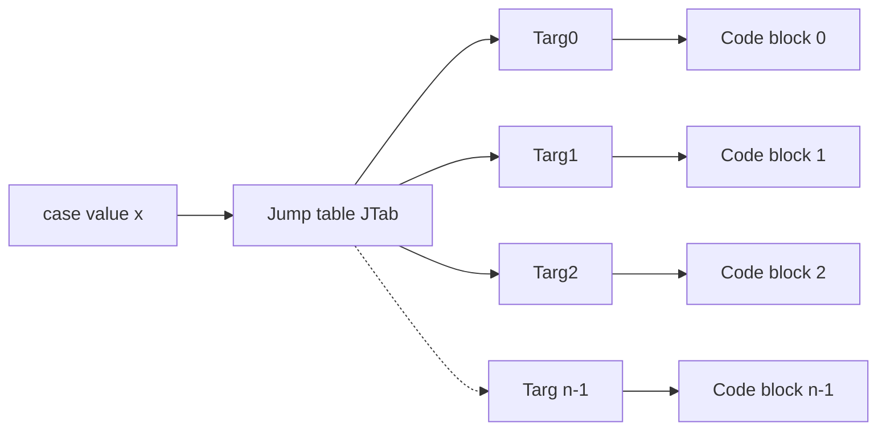

# Machine-Level Programming II: ~={yellow}Control=~
> How to control the flow of execution of instructions at the machine level.

# Control: Condition codes
条件码：条件指令运作的基础

## Processor State (x86-64. Partial)
### Information about currently executing program
- Temporary data
	(`%rax, ...`)
- Location of runtime stack
	(`%rsp`)
- Location of current code control point
	(`%rip, ...`)
- Status of recent tests
	(CF, ZF, SF, OF)
#### 对于大部分寄存器，~={red}*唯一真正特别*=~的是 `%rsp`
- 它存的是栈指针，告诉我们栈顶在哪里
- 所以不能像对其他寄存器那样随意地使用或设置它
#### `%rip`
- 指令指针（instruction pointer）
- 它包含现在正在执行的指令的地址
- 它不是能以正常方式访问的寄存器，需要一些 tricks

## 条件码 (Condition Codes)
这些是~={purple}**单个比特的寄存器**=~，由最近的算术或逻辑操作**隐式设置**（作为副作用）。

| **标志位** | **全称**        | **触发场景**                        | **描述**   |
| ------- | ------------- | ------------------------------- | -------- |
| **CF**  | Carry Flag    | 最近的操作导致最高位产生了进位（用于==无符号==溢出）。   | **进位标志** |
| **ZF**  | Zero Flag     | 最近的操作结果等于 **0**。                | **零标志**  |
| **SF**  | Sign Flag     | 最近的操作结果小于 **0**（结果的最高位为 1）。     | **符号标志** |
| **OF**  | Overflow Flag | 最近的操作导致==补码==溢出（正+正=负 或 负+负=正）。 | **溢出标志** |

### Implicitly set (think of it as side effect) by arithmetic operations
Example: `addq`Src, Dest <-> `t = a + b`
- ~={red}**CF set**=~ if carry out from most significant bit (unsigned overflow)
- ~={red}**ZF set**=~ if `t == 0`
- ~={red}**SF set**=~ if `t < 0`(as signed)
- ~={red}**OF set**=~ if two's complement (signed) overflow
	- `(a > 0 && b > 0 && t < 0) || (a < 0 && b < 0 && t >= 0)`
- **NOT** set by `leaq` instruction
### Explicit Setting by Compare Instruction
- **`cmpq Src2, Src1`**
- **`cmpq b, a` like computing `a-b` without setting destination**
- 这个指令==唯一的目的==就是设置条件码
- ~={red}**CF set**=~ if carry out from most significant bit (used for unsigned comparisons)
- ~={red}**ZF set**=~ if `a == b`
- ~={red}**SF set**=~ if `(a-b) < 0` (as signed)
- ~={red}**OF set**=~ if two's-complement (signed) overflow
    - `(a>0 && b<0 && (a-b)<0) || (a<0 && b>0 && (a-b)>0)`
### Explicit Setting by Test instruction

* **testq Src2, Src1**
    * `testq b, a` like computing `a & b` without setting destination
    * 其本质就是==按位与==操作

* Sets condition codes based on value of Src1 & Src2
* Useful to have one of the operands be a mask

* ~={red}**ZF set**=~ when `a & b == 0`
* ~={red}**SF set**=~ when `a & b < 0`
## Reading Condition Codes
| **指令**    | **对应的条件码逻辑**       | **描述 (C 语言含义)**                             |
| --------- | ------------------ | ------------------------------------------ |
| **sete**  | `ZF`               | **Equal / Zero** (a == b)                  |
| **setne** | `~ZF`              | **Not Equal / Not Zero** (a != b)          |
| **sets**  | `SF`               | **Negative** (结果为负)                        |
| **setns** | `~SF`              | **Nonnegative** (结果为非负)                    |
| **setg**  | `~(SF ^ OF) & ~ZF` | **Greater (Signed)** (有符号 a > b)           |
| **setge** | `~(SF ^ OF)`       | **Greater or Equal (Signed)** (有符号 a >= b) |
| **setl**  | `SF ^ OF`          | **Less (Signed)** (有符号 a < b)              |
| **setle** | `(SF ^ OF) \| ZF`  | **Less or Equal (Signed)** (有符号 a <= b)    |
| **seta**  | `~CF & ~ZF`        | **Above (Unsigned)** (无符号 a > b)           |
| **setb**  | `CF`               | **Below (Unsigned)** (无符号 a < b)           |
- `set` 指令的作用是将~={yellow}单个寄存器=~的~={yellow}单个字节=~设置为 `1` 或 `0`
- 基于条件码的值
- 必须考虑溢出的问题
- 16 个寄存器都可以直接将最低位设置为 0 或 1，~={pink}且不会影响其他 7 个字节=~

# Conditional branches
```C
int gt (long x, long y) {
    return x > y;
}
```
对应的汇编代码：
```Assembly
# 参数: x 存于 %rdi, y 存于 %rsi
# 返回值: %rax

cmpq    %rsi, %rdi      # 1. 比较 x 和 y (内部执行 x - y)
setg    %al             # 2. 若 x > y，将 %al 设为 1；否则设为 0
movzbl  %al, %eax       # 3. 零扩展：将 %al 的值移动到 %eax，并清空高位
ret                     # 4. 返回
```

| **步骤**  | **指令类型** | **作用** | **状态变化**           |
| ------- | -------- | ------ | ------------------ |
| **第一步** | `cmpq`   | 比较逻辑   | 设置 ZF, SF, OF 等标志位 |
| **第二步** | `setg`   | 读取标志   | 将逻辑结果存入寄存器最末尾 1 字节 |
| **第三步** | `movzbl` | 格式化    | **彻底清除**寄存器高位的垃圾数据 |
- `movzbl`:
	- `z`(Zero-extend): 零扩展
	- `b`(Byte): 源操作数是 1 字节
	- `l`(Long/Double word): 目的操作数是 4 字节
	
- x86-64 有个奇怪的地方：任何得到~={green}32 位结果=~的计算都会把寄存器的~={green}另外 32 位=~设置为 0
	- 所以我们只用写 `movzbl %al, %eax` 而不用 `movzbl %al, %rax`
	- 两者~={yellow}*效果完全一样*=~
	- 但前者操作 32 位寄存器，不需要额外的 `REX` 前缀用于标识 64 位操作

## Jumping
### `jX` instructions
- Jump to different part of code depending on condition codes


|**指令 (jX)**|**条件逻辑 (Condition)**|**描述 (Description)**|**常用场景**|
|---|---|---|---|
|**`jmp`**|$1$|Unconditional|无条件跳转|
|**`je`**|$ZF$|Equal / Zero|相等 / 结果为零|
|**`jne`**|$\sim ZF$|Not Equal / Not Zero|不相等 / 结果非零|
|**`js`**|$SF$|Negative|结果为负（符号位为 1）|
|**`jns`**|$\sim SF$|Nonnegative|结果为正或零|
|**`jg`**|$\sim(SF \oplus OF) \ \& \ \sim ZF$|Greater (Signed)|**大于**（有符号）|
|**`jge`**|$\sim(SF \oplus OF)$|Greater or Equal (Signed)|**大于等于**（有符号）|
|**`jl`**|$(SF \oplus OF)$|Less (Signed)|**小于**（有符号）|
|**`jle`**|$(SF \oplus OF) \ \vert \ ZF$|Less or Equal (Signed)|**小于等于**（有符号）|
|**`ja`**|$\sim CF \ \& \ \sim ZF$|Above (Unsigned)|**高于**（无符号）|
|**`jb`**|$CF$|Below (Unsigned)|**低于**（无符号）|
### Example
```C
long absdiff(long x, long y)
{
    long result;
    if (x > y)
        result = x - y;  // 分支 A：当 x > y 时执行
    else
        result = y - x;  // 分支 B：当 x <= y 时执行
    return result;
}
```
对应的汇编代码：
```gas
# 参数: x 存于 %rdi, y 存于 %rsi
# 返回值: %rax

absdiff:
    cmpq    %rsi, %rdi      # 1. 比较 x : y (计算 %rdi - %rsi)
    jle     .L4             # 2. 如果 x <= y，跳转到标签 .L4

    # --- 分支 A: x > y ---
    movq    %rdi, %rax      # 3a. 把 x 放到返回值寄存器
    subq    %rsi, %rax      # 4a. 计算 %rax = x - y
    ret                     # 5a. 返回

.L4:
    # --- 分支 B: x <= y ---
    movq    %rsi, %rax      # 3b. 把 y 放到返回值寄存器
    subq    %rdi, %rax      # 4b. 计算 %rax = y - x
    ret                     # 5b. 返回
```
- 这里不可以先 `subq` 再 `movq`！
- 如果这样做，会把 `%rdi` 覆盖掉，也就是==弄丢了==参数 `x`，如果后续还需要 `x`，就找不回来了

## Using Conditional Moves
- 基本思想是~={red}**先**=~把 `then` 代码和 `eles` 代码都执行得到两个结果
- 然后我才会选择使用哪一个结果
- 看起来浪费时间，但事实上它被证明==更有效率==
### Example
```C
long absdiff(long x, long y) {
    long result;
    if (x > y)
        result = x - y;
    else
        result = y - x;
    return result;
}
```
对应的汇编代码：
```Assembly
absdiff:
    movq    %rdi, %rax    # 将 x 放入 %rax
    subq    %rsi, %rax    # 计算 %rax = x - y (预存第一个结果)
    movq    %rsi, %rdx    # 将 y 放入 %rdx
    subq    %rdi, %rdx    # 计算 %rdx = y - x (计算第二个结果)
    cmpq    %rsi, %rdi    # 比较 x : y (设置状态位)
    cmovle  %rdx, %rax    # 如果 x <= y，则将 %rdx 的值覆盖到 %rax
    ret                   # 返回 %rax 中的最终结果
```
- `cmov` 就是 conditional `mov`，先检查状态寄存器，如果满足特定条件才把数据从 A 搬到 B
### Bad Cases for Conditional Move
#### Expensive Computations
`val = Test(x) ? Hard1(x) : Hard2(x);`
- 如果两个分支很~={cyan}耗费时间就不行=~
- Only make sense when computations are very simple
#### Risky Computations
`val = p ? *p : 0;`
- May have~={cyan} undesirable effects=~
- 单看这个例子，它有可能导致~={yellow}**对空指针解引用**=~（那将非常糟糕！）
#### Computations with side effects
`val = x > 0 ? x *= 7 : x += 3;`
- Must be ~={cyan}side-effect free=~
- 若执行任一分支的结果可能会==改变程序其他部分的状态==，那么就不要这样做

所以 `cmov` 的应用范围没有想象中广

# Loops

## `Do-While` Loop Example
首先尝试把循环改写成 `goto` 版本：
```C
long pcount_do(unsigned long x) {
	long result = 0;
	do {
		result += x & 0x1;
		x >>= 1;
	} while (x);
	return result;
}
```
Its `goto` version:
```C
long pcount_do(unsigned long x) {
	long result = 0;
	loop:
	result += x & 0x1;
	x >>= 1;
	if (x) goto loop;
	return result;
}
```
Its `Assembly`:
```Assembly
# pcount_goto 函数的汇编实现
pcount_goto:
    movl    $0, %eax        # result = 0 (使用 32 位指令清空 rax，高 32 位自动设 0)
.L2:                        # loop: 标号，对应 C 语言中的 loop:
    movq    %rdi, %rdx      # 将当前的 x 复制一份到 rdx
    andl    $1, %edx        # t = x & 0x1 (取 x 的最低位)
    addq    %rdx, %rax      # result += t (将取出的位加到结果中)
    shrq    %rdi            # x >>= 1 (逻辑右移一位，等价于 x = x / 2)
    jne     .L2             # if (x != 0) goto .L2 (只要 x 还不为 0 就继续循环)
    rep; ret                # return result (rep 为某些处理器的优化补丁，实际执行 ret)
```

## `GCC` 的两种编译循环的方式
### General "While" Translation \#1
- ~={cyan}"Jump-to-middle=~" translation
- Used with `-Og`(`O` means Optimize and `g` means debug)
	- `-Og` 是这门课用到的优化
	- `-O1` 是下一个级别

**Source `while` loop**

```c
while (Test)
    Body
```

**Jump-to-middle translation**

```c
goto test;
loop:
    Body
test:
    if (Test)
        goto loop;
done:
```

### General "While" Translation \#2
-~={cyan} "Guarded Do-While"=~

This form is used by `-O1`: the initial guard converts the loop to a `do-while`, which then maps directly to a conditional backward jump.

**Source `while` loop**

```c
while (Test)
    Body
```

**Guarded `do-while`**

```c
if (!Test)
    goto done;
do {
    Body
} while (Test);
done:
```

**Equivalent `goto` form**

```c
if (!Test)
    goto done;
loop:
    Body
    if (Test)
        goto loop;
done:
```

## "For" Loop Form
可以将 `for` 循环转化为 `while` 循环

# Switch Statements
## Example

```C
long switch_eg(long x, long y, long z)
{
    long w = 1;
    switch(x) {
        case 1:
            w = y*z;
            break;
        case 2:
            w = y/z;
            /* Fall Through */
        case 3:
            w += z;
            break;
        case 5:
        case 6:
            w -= z;
            break;
        default:
            w = 2;
    }
    return w;
}
```
- **Multiple case labels (5 & 6)**：多个 case 共用一段逻辑。
    
- **Fall through (2)**：case 2 后面没有 `break`，会直接“掉进” case 3 继续执行。
	在不经过判断的情况下~={yellow}直接执行=~`w += z`
	>这是编程语言历史上最糟糕的设计之一。——*Bryant 教授*
- **Missing cases (4)**：代码里没有 case 4。
## Jump Table Structure


```c
switch (x) {
    case val_0: Block0;
    case val_1: Block1;
    /* ... */
    case val_n_1: BlockN1;
}

/* Extended C notation used to explain the compiled form: */
goto *JTab[x];
```



## Switch Statement Example
```C
long switch_eg(long x, long y, long z)
{
    long w = 1;
    switch(x) {
		...
    }
    return w;
}
```
Setup:
```Assembly
# Setup: 假设 %rdi=x, %rsi=y, %rdx=z
switch_eg:
    movq    %rdx, %rcx      # 备份 z 到 %rcx
    cmpq    $6, %rdi        # 检查 x : 6 (最大 case 值为 6)
    ja      .L8             # 如果 x > 6 (无符号)，直接跳到 default (.L8)
    jmp     *.L4(,%rdi,8)   # 间接跳转：通过跳转表 .L4 飞往对应的 case
```
