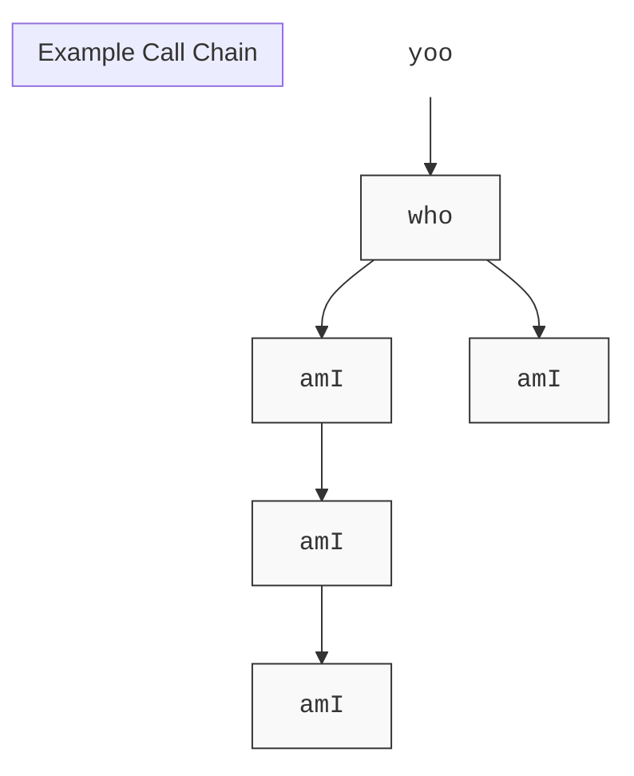

# Machine-Level Programming III: Procedures

## Procedure
`C`中我们称之为`function`，在`Java`中叫`method`
	——但在机器级代码中，我们统称为**Procedure**
## ABI
Application Binary Interface*应用二进制接口*
本质上是一套强制性的协议
## Mechanisms in Procedures
- Passing Control
- Passing Data
- Memory Management
# Procedures
## Stack Structure

### x86-64 Stack

- 对于汇编层面的程序员而言，内存只是一个巨大的字节数组
- 在那一堆字节中的某个地方，我们称之为~={yellow}**栈**=~
	- Region of memory managed with stack discipline
	- Grows toward lower addresses
	- Register `%rsp` contains~={cyan} lowest stack address=~（栈顶）
- 调用返回的思想与栈的后进先出的原则相通

<div style="font-family: 'Segoe UI', Arial, sans-serif; background: #ffffff; padding: 40px; border-radius: 12px; display: flex; flex-direction: column; align-items: center; width: fit-content; margin: auto;">

    <div style="text-align: center; margin-bottom: 15px;">
        <div style="color: #2e3192; font-weight: 800; font-size: 18px; margin-bottom: 5px;">Stack "Bottom"</div>
        <div style="color: #c1272d; font-size: 20px; line-height: 1;">▼</div>
    </div>

    <div style="display: flex; align-items: stretch; gap: 0;">
        
        <div style="width: 160px; display: flex; flex-direction: column;">
            <div style="height: 200px;"></div>
            <div style="display: flex; align-items: flex-start; justify-content: flex-end; margin-top: -12px;">
                <div style="text-align: right; margin-right: 10px;">
                    <div style="background: #2e3192; color: #fff; padding: 4px 10px; border-radius: 4px; font-weight: 800; font-size: 14px; box-shadow: 2px 2px 5px rgba(0,0,0,0.1);">
                        %rsp
                    </div>
                    <div style="color: #666; font-size: 11px; margin-top: 2px;">(Stack Pointer)</div>
                </div>
                <span style="color: #2e3192; font-size: 24px; font-weight: bold; line-height: 1;">──▶</span>
            </div>
        </div>

        <div style="width: 140px; border: 2.5px solid #000; background-color: #f0f1ff; display: flex; flex-direction: column; box-shadow: 4px 4px 10px rgba(0,0,0,0.05);">
            <div style="height: 200px;"></div>
            <div style="height: 80px; background-color: #d1d3ff; border-top: 2.5px solid #000; display: flex; align-items: center; justify-content: center; font-size: 14px; font-weight: 800; color: #2e3192;">
                Top Element
            </div>
        </div>

        <div style="width: 150px; margin-left: 30px; display: flex; flex-direction: column; justify-content: space-between; padding: 10px 0;">
            <div style="border-left: 3px solid #444; padding-left: 12px; height: 100px; position: relative; display: flex; align-items: center; font-weight: 700; color: #444; font-size: 13px;">
                <div style="position: absolute; top: -10px; left: -8px;">▲</div>
                Increasing<br>Addresses
            </div>
            <div style="border-left: 3px solid #444; padding-left: 12px; height: 100px; position: relative; display: flex; align-items: center; font-weight: 700; color: #444; font-size: 13px;">
                <div style="position: absolute; bottom: -10px; left: -8px;">▼</div>
                Stack<br>Grows<br>Down
            </div>
        </div>
    </div>

    <div style="text-align: center; margin-top: 15px;">
        <div style="color: #c1272d; font-size: 20px; line-height: 1;">▲</div>
        <div style="color: #2e3192; font-weight: 800; font-size: 18px; margin-top: 5px;">Stack "Top"</div>
    </div>

</div>

*（这个图画得有点不准确）*
#### Push
- `pushq` Src
	- Fetch oprand at src
	- Decrement `%rsp` by 8
	- Write operand at address given by `%rsp`
	- 该源操作数可以来自寄存器、内存或立即数
#### Pop
- `popq` Dest
	- Read value at address given by `%rsp`
	- Increment `%rsp` by 8
	- Store value at Dest~={cyan} (must be register)=~
## Calling Conventions

### Passing Control
#### Procedure Control Flow

程序计数器（program counter）：`%rip`

- Use stack to support procedure call and return
- ~={red}**Procedure call:**=~ `call label`
	- Push return address on stack
	- Jump to `label`
- **Return address:**
	- Address of the next instruction right after cll
	- Example from disassembly
- ~={red}**Procedure return:** =~`ret`
	- Pop address from stack
	- Jump to address

<div style="font-family: 'Consolas', 'Monaco', monospace; background: #1e1e1e; color: #d4d4d4; padding: 30px; border-radius: 15px; display: flex; gap: 40px; width: fit-content; margin: auto; border: 2px solid #444;">

    <div style="flex: 1;">
        <h3 style="color: #569cd6; border-bottom: 1px solid #444; padding-bottom: 5px;">Code Segment (Read-Only)</h3>
        
        <div style="margin-bottom: 20px; border-left: 3px solid #ce9178; padding-left: 10px;">
            <div style="color: #6a9955;">&lt;multstore&gt; : 0x400540</div>
            <div style="padding: 5px 0; opacity: 0.5;">... (previous instructions)</div>
            <div style="background: #333; padding: 2px 5px; color: #dcdcaa;">
                <span style="color: #858585;">400544:</span> callq 400550 
                <span style="color: #6a9955; font-size: 11px;">; 占用 5 字节</span>
            </div>
            <div style="padding: 2px 5px; border: 1px dashed #569cd6;">
                <span style="color: #858585;">400549:</span> mov %rax, (%rbx)
                <span style="color: #569cd6; font-size: 11px;"> &lt;-- Return Address</span>
            </div>
        </div>

        <div style="border-left: 3px solid #b5cea8; padding-left: 10px;">
            <div style="color: #6a9955; background: #2d2d2d;">&lt;mult2&gt; : 0x400550</div>
            <div style="padding: 2px 5px; color: #dcdcaa;">
                <span style="color: #858585;">400550:</span> mov %rdi, %rax
            </div>
            <div style="padding: 5px 0; opacity: 0.5;">... (function body)</div>
        </div>
    </div>

    <div style="width: 220px; display: flex; flex-direction: column; justify-content: center; gap: 20px;">
        <div style="border: 2px solid #c586c0; padding: 10px; border-radius: 8px; text-align: center;">
            <div style="font-size: 12px; color: #c586c0;">Program Counter (%rip)</div>
            <div style="font-size: 18px; font-weight: bold; color: #fff;">0x400550</div>
            <div style="font-size: 10px; color: #858585; margin-top: 5px;">指向 mult2 第一行</div>
        </div>
        
        <div style="text-align: center; color: #569cd6; font-size: 24px;">跳转 ──▶</div>
        <div style="text-align: center; color: #ce9178; font-size: 24px;">◀── 压栈</div>

        <div style="border: 2px solid #4ec9b0; padding: 10px; border-radius: 8px; text-align: center;">
            <div style="font-size: 12px; color: #4ec9b0;">Stack Pointer (%rsp)</div>
            <div style="font-size: 18px; font-weight: bold; color: #fff;">0x118</div>
        </div>
    </div>

    <div style="width: 200px;">
        <h3 style="color: #4ec9b0; border-bottom: 1px solid #444; padding-bottom: 5px;">Stack (Memory)</h3>
        <div style="border: 2px solid #444; background: #252526; height: 260px; display: flex; flex-direction: column; justify-content: flex-end;">
            <div style="height: 40px; border-bottom: 1px solid #444; display: flex; align-items: center; justify-content: center; font-size: 12px; opacity: 0.3;">0x130</div>
            <div style="height: 40px; border-bottom: 1px solid #444; display: flex; align-items: center; justify-content: center; font-size: 12px; opacity: 0.3;">0x128</div>
            <div style="height: 40px; border-bottom: 2px solid #569cd6; display: flex; align-items: center; justify-content: center; font-size: 12px; opacity: 0.3;">0x120</div>
            
            <div style="height: 60px; background: #264f78; border: 1px solid #569cd6; display: flex; flex-direction: column; align-items: center; justify-content: center;">
                <div style="font-size: 10px; color: #9cdcfe;">Address: 0x118</div>
                <div style="font-weight: bold; color: #fff;">0x400549</div>
                <div style="font-size: 9px; color: #858585;">(Saved Return Addr)</div>
            </div>
        </div>
        <div style="text-align: center; margin-top: 10px; color: #4ec9b0; font-weight: bold;">Stack Top ▲</div>
    </div>

</div>

- 可以说，`ret`的目的是逆转`call`的效果
- 它假定栈顶有一个你想要跳转的地址
- 所以它会`pop`一下，增加栈指针
	- 同理`call`暗含了一个`push`

### Passing Data

 - IA-32时期，所有参数都在栈中传递
 - 但现在我们用寄存器传递参数
 - 原因：寄存器访问比内存访问快得多

### Managing local data

#### Stack-Based Languages

- Language that support recursion
	- e.g., C, Pascal, Java
	- Code must be ~={red}**=="Reentrant"==** =~(可重入的) 
		- Multiple simultaneous instantiations of single procedure
	- Need some plve to store state of each instantiation
		- Arguments
		- Local variables
		- Return pointer

- Stack discipline
	- State for given procedure needed for limited time
		- From when called to when return
	- ~={orange}Callee returnd before caller does=~

- Stack allocated in ~={red}**Frames**=~
- Stack Frame: ==栈帧==
	- state for single procedure instantiation
	- ~={pink}**我们把栈上用于特定`call`的每个内存块称为栈帧**=~

为什么要用栈：
- 在栈上可分配空间，如果调用更多函数，一直分配下去就是了
- 返回时退出栈并释放空间
- 栈的规则~={yellow}完全适用=~


虽然图片看起来有两个分支，但在 CPU 运行的任何一个**瞬间**，栈（Stack）里只可能存在**一条**路径。
- **左侧分支**：当 `who` 调用第一个 `amI`，且这个 `amI` 又递归调用自己时，栈会不断向下生长，形成一个长长的“单链表”。
    
- **右侧分支**：当左边的 `amI` 全部执行完 `ret` 弹出后，控制权回到 `who`。接着 `who` 执行下一行指令，调用右边的 `amI`。
    
- 栈空间是~={yellow}**复用**=~的。右边的 `amI` 往往会直接~={yellow}覆盖掉=~之前左边 `amI` 曾经用过的内存地址

#### Stack Frames（栈帧）

##### Contents
- Return information
- Local storage (if needed)
- Temporary space (if needed)

- 编译器会在~={cyan}编译阶段=~就精确计算出一个函数栈帧所需的~={cyan}固定大小=~
##### 关于`%rbp`

在函数主体执行期间，通常满足这个关系：

$$\text{\%rbp} = \text{\%rsp} + \text{局部变量空间大小} + \text{被保存的寄存器空间}$$

由于 `%rbp` 存的是这个固定的位置，所以：

- **`0(%rbp)`**：存放的是“旧的 `%rbp`”（也就是上一层函数的锚点）。
    
- **`8(%rbp)`**：存放的是“返回地址”。
    
- **`-8(%rbp)`**：存放的是本函数的第一个局部变量。

### Register Saving Conventions

#### When procedure `yoo` calls `who`:
- `yoo` is the ~={red}caller=~
- `who` is the ~={red}callee=~

#### Can register be used for temporary storage?


<div style="display: flex; gap: 20px; font-family: 'Consolas', 'Courier New', monospace; background-color: #eeeeee; padding: 30px; justify-content: center;">
    <div style="background-color: #fff9c4; border: 2.5px solid #000000; box-shadow: 6px 6px 0px #666666; padding: 15px 25px; min-width: 260px; color: #000000;">
        <div style="font-weight: bold; font-size: 1.3em; margin-bottom: 8px;">yoo:</div>
        <div style="margin: 5px 0; letter-spacing: 5px; font-weight: bold; color: #333;">. . .</div>
        <div style="margin: 4px 0; white-space: pre; font-weight: 500;">  movq  &#36;15213, <span style="color: #b71c1c; font-weight: 800;">%rdx</span></div>
        <div style="margin: 4px 0; white-space: pre; font-weight: 500;">  call  who</div>
        <div style="margin: 4px 0; white-space: pre; font-weight: 500;">  addq  <span style="color: #b71c1c; font-weight: 800;">%rdx</span>, %rax</div>
        <div style="margin: 5px 0; letter-spacing: 5px; font-weight: bold; color: #333;">. . .</div>
        <div style="margin: 4px 0; white-space: pre; font-weight: 500;">  ret</div>
    </div>

    <div style="background-color: #e8f5e9; border: 2.5px solid #000000; box-shadow: 6px 6px 0px #666666; padding: 15px 25px; min-width: 260px; color: #000000;">
        <div style="font-weight: bold; font-size: 1.3em; margin-bottom: 8px;">who:</div>
        <div style="margin: 5px 0; letter-spacing: 5px; font-weight: bold; color: #333;">. . .</div>
        <div style="margin: 4px 0; white-space: pre; font-weight: 500;">  subq  &#36;18213, <span style="color: #b71c1c; font-weight: 800;">%rdx</span></div>
        <div style="margin: 5px 0; letter-spacing: 5px; font-weight: bold; color: #333;">. . .</div>
        <div style="margin: 4px 0; white-space: pre; font-weight: 500;">  ret</div>
    </div>
</div>

- 如果我们真的想要某个值在返回时保持不变，则应该首先存储它，不应假设寄存器的值会一直不变，==应假设它会被改变==

#### Conventions

- ~={cyan}**"Caller Saved"**=~
	- Caller saves temporary values in its frame before the call
- ~={cyan}**"Callee Saved"**=~
	- Callee saves temporary values in its frame before using
	- Callee restores them before returning to caller

- 在递归调用中，caller-saved~={red}更容易导致栈溢出=~

<div style="font-family: 'Segoe UI', Arial, sans-serif; margin: 20px 0; color: #000000;">
    <table style="border-collapse: collapse; width: 100%; background-color: #ffffff; border: 3px solid #000000; box-shadow: 8px 8px 0px #333333;">
        <thead>
            <tr style="background-color: #1a1a1a; color: #ffffff; text-align: left;">
                <th style="padding: 15px; border: 2px solid #000000; font-size: 1.1em;">保存类别 (Type)</th>
                <th style="padding: 15px; border: 2px solid #000000; font-size: 1.1em;">寄存器 (Registers)</th>
                <th style="padding: 15px; border: 2px solid #000000; font-size: 1.1em;">详细用途 (Usage)</th>
            </tr>
        </thead>
        <tbody>
            <tr style="background-color: #fff59d;">
                <td style="padding: 12px; border: 2px solid #000000; font-weight: 900; color: #000000;">
                    Caller-Saved<br><span style="font-size: 0.85em;">(调用者保存)</span>
                </td>
                <td style="padding: 12px; border: 2px solid #000000; font-family: 'Consolas', monospace; font-weight: 900; color: #8b0000;">
                    %rax
                </td>
                <td style="padding: 12px; border: 2px solid #000000; font-weight: 700; color: #000000;">
                    <b>返回值</b>。存放函数执行后的结果。
                </td>
            </tr>
            <tr style="background-color: #fff59d;">
                <td style="padding: 12px; border: 2px solid #000000; font-weight: 900; color: #000000;">Caller-Saved</td>
                <td style="padding: 12px; border: 2px solid #000000; font-family: 'Consolas', monospace; font-weight: 900; color: #8b0000;">
                    %rdi, %rsi, %rdx, %rcx, %r8, %r9
                </td>
                <td style="padding: 12px; border: 2px solid #000000; font-weight: 700; color: #000000;">
                    <b>传递参数</b>。分别对应第 1 到 第 6 个函数参数。
                </td>
            </tr>
            <tr style="background-color: #fff59d;">
                <td style="padding: 12px; border: 2px solid #000000; font-weight: 900; color: #000000;">Caller-Saved</td>
                <td style="padding: 12px; border: 2px solid #000000; font-family: 'Consolas', monospace; font-weight: 900; color: #8b0000;">
                    %r10, %r11
                </td>
                <td style="padding: 12px; border: 2px solid #000000; font-weight: 700; color: #000000;">
                    <b>临时寄存器</b>。调用者需自行保护，否则会被子函数覆盖。
                </td>
            </tr>
            <tr style="background-color: #81c784;">
                <td style="padding: 12px; border: 2px solid #000000; font-weight: 900; color: #000000;">
                    Callee-Saved<br><span style="font-size: 0.85em;">(被调用者保存)</span>
                </td>
                <td style="padding: 12px; border: 2px solid #000000; font-family: 'Consolas', monospace; font-weight: 900; color: #8b0000;">
                    %rbx, %r12, %r13, %r14
                </td>
                <td style="padding: 12px; border: 2px solid #000000; font-weight: 700; color: #000000;">
                    <b>长期存储</b>。子函数若使用必须先备份（push），返回前还原。
                </td>
            </tr>
            <tr style="background-color: #81c784;">
                <td style="padding: 12px; border: 2px solid #000000; font-weight: 900; color: #000000;">Callee-Saved</td>
                <td style="padding: 12px; border: 2px solid #000000; font-family: 'Consolas', monospace; font-weight: 900; color: #8b0000;">
                    %rbp
                </td>
                <td style="padding: 12px; border: 2px solid #000000; font-weight: 700; color: #000000;">
                    <b>帧指针</b>。锚定栈帧（可选），必须跨调用保持一致。
                </td>
            </tr>
            <tr style="background-color: #e0e0e0;">
                <td style="padding: 12px; border: 2px solid #000000; font-weight: 900; color: #000000;">Special</td>
                <td style="padding: 12px; border: 2px solid #000000; font-family: 'Consolas', monospace; font-weight: 900; color: #8b0000;">
                    %rsp
                </td>
                <td style="padding: 12px; border: 2px solid #000000; font-weight: 700; color: #000000;">
                    <b>栈指针</b>。指向当前栈顶，由硬件和指令自动管理。
                </td>
            </tr>
        </tbody>
    </table>
</div>

#### Callee-Saved Example \#1
```C
long call_incr2(long x) {
    long v1 = 15213;
    long v2 = incr(&v1, 3000);
    return x + v2;
}
```
汇编代码：
```Assembly
call_incr2:
    pushq   %rbx           # 保存旧的 %rbx 值 (Callee-saved)
    subq    $16, %rsp      # 分配 16 字节的栈空间
    movq    %rdi, %rbx     # 将参数 x 暂存在 %rbx 中，防止 call incr 时被改掉
    movq    $15213, 8(%rsp)# 将 15213 存入栈中 (即变量 v1)
    movl    $3000, %esi    # 准备 incr 的第二个参数 (3000)
    leaq    8(%rsp), %rdi  # 准备 incr 的第一个参数 (&v1)
    call    incr           # 调用 incr(&v1, 3000)，结果返回到 %rax
    addq    %rbx, %rax     # 计算 x + v2 (此时 %rbx 是之前存的 x)
    addq    $16, %rsp      # 释放 16 字节栈空间
    popq    %rbx           # 恢复旧的 %rbx 值
    ret                    # 返回
```

## Illustration of recursion

- C-Compiler并不需要特殊考虑递归函数，它和正常函数别无二致
- 正是栈的原则保证了它的可行性