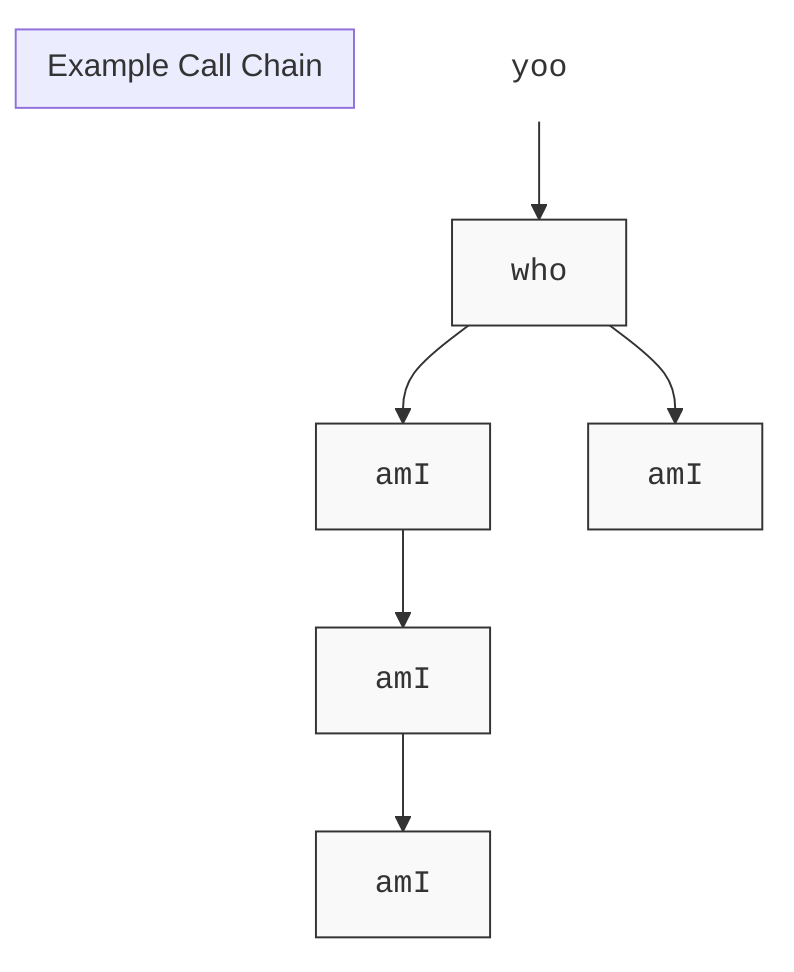

# Machine-Level Programming III: Procedures

## Procedure
`C` 中我们称之为 `function`，在 `Java` 中叫 `method`
	——但在机器级代码中，我们统称为**Procedure**
## ABI
Application Binary Interface*应用二进制接口*
本质上是一套强制性的协议
## Mechanisms in Procedures
- Passing Control
- Passing Data
- Memory Management
# Procedures
## Stack Structure

### x86-64 Stack

- 对于汇编层面的程序员而言，内存只是一个巨大的字节数组
- 在那一堆字节中的某个地方，我们称之为~={yellow}**栈**=~
	- Region of memory managed with stack discipline
	- Grows toward lower addresses
	- Register `%rsp` contains~={cyan} lowest stack address=~（栈顶）
- 调用返回的思想与栈的后进先出的原则相通

<figure class="stack-map" aria-labelledby="stack-map-title">
    <header class="stack-map__header">
        <div>
            <span class="stack-map__eyebrow">x86-64 memory model</span>
            <strong id="stack-map-title">The stack grows toward lower addresses</strong>
        </div>
        <code>%rsp</code>
    </header>
    <div class="stack-map__canvas">
        <div class="stack-map__axis" aria-label="Memory addresses increase upward">
            <span>high address</span>
            <i aria-hidden="true"></i>
            <span>low address</span>
        </div>
        <div class="stack-map__memory" aria-label="Stack memory">
            <div class="stack-map__cell stack-map__cell--bottom">
                <small>stack bottom</small>
                <span>older stack data</span>
            </div>
            <div class="stack-map__cell">
                <small>current frame</small>
                <span>saved values · local data</span>
            </div>
            <div class="stack-map__cell stack-map__cell--top">
                <small>stack top</small>
                <strong>top element</strong>
            </div>
            <div class="stack-map__next">
                <span>next push / call</span>
                <span aria-hidden="true">↓</span>
            </div>
        </div>
        <div class="stack-map__pointer">
            <code>%rsp</code>
            <span>points to the lowest address currently in use</span>
        </div>
    </div>
    <figcaption>
        Addresses increase upward; pushing data moves <code>%rsp</code> downward to a lower address.
    </figcaption>
</figure>
#### Push
- `pushq` Src
	- Fetch oprand at src
	- Decrement `%rsp` by 8
	- Write operand at address given by `%rsp`
	- 该源操作数可以来自寄存器、内存或立即数
#### Pop
- `popq` Dest
	- Read value at address given by `%rsp`
	- Increment `%rsp` by 8
	- Store value at Dest~={cyan} (must be register)=~
## Calling Conventions

### Passing Control
#### Procedure Control Flow

程序计数器（program counter）：`%rip`

- Use stack to support procedure call and return
- ~={red}**Procedure call:**=~ `call label`
	- Push return address on stack
	- Jump to `label`
- **Return address:**
	- Address of the next instruction right after cll
	- Example from disassembly
- ~={red}**Procedure return:** =~`ret`
	- Pop address from stack
	- Jump to address

```mermaid
flowchart LR
    call[5-byte callq at 0x400544] -->|push return address 0x400549| stack[stack top at 0x118]
    call -->|set %rip = 0x400550| callee[mult2 begins]
    callee -->|ret pops 0x400549| resume[resume at address 0x400549]
```

The `call` instruction performs two state changes: it saves the address of the following instruction on the stack and transfers control to the callee. `ret` reverses those changes by popping that saved address into `%rip`.

- 可以说，`ret` 的目的是逆转 `call` 的效果
- 它假定栈顶有一个你想要跳转的地址
- 所以它会 `pop` 一下，增加栈指针
	- 同理 `call` 暗含了一个 `push`

### Passing Data

 - IA-32 时期，所有参数都在栈中传递
 - 但现在我们用寄存器传递参数
 - 原因：寄存器访问比内存访问快得多

### Managing local data

#### Stack-Based Languages

- Language that support recursion
	- e.g., C, Pascal, Java
	- Code must be ~={red}**=="Reentrant"==** =~(可重入的) 
		- Multiple simultaneous instantiations of single procedure
	- Need some plve to store state of each instantiation
		- Arguments
		- Local variables
		- Return pointer

- Stack discipline
	- State for given procedure needed for limited time
		- From when called to when return
	- ~={orange}Callee returnd before caller does=~

- Stack allocated in ~={red}**Frames**=~
- Stack Frame: ==栈帧==
	- state for single procedure instantiation
	- ~={pink}**我们把栈上用于特定 `call` 的每个内存块称为栈帧**=~

为什么要用栈：
- 在栈上可分配空间，如果调用更多函数，一直分配下去就是了
- 返回时退出栈并释放空间
- 栈的规则~={yellow}完全适用=~


虽然图片看起来有两个分支，但在 CPU 运行的任何一个**瞬间**，栈（Stack）里只可能存在**一条**路径。
- **左侧分支**：当 `who` 调用第一个 `amI`，且这个 `amI` 又递归调用自己时，栈会不断向下生长，形成一个长长的“单链表”。
    
- **右侧分支**：当左边的 `amI` 全部执行完 `ret` 弹出后，控制权回到 `who`。接着 `who` 执行下一行指令，调用右边的 `amI`。
    
- 栈空间是~={yellow}**复用**=~的。右边的 `amI` 往往会直接~={yellow}覆盖掉=~之前左边 `amI` 曾经用过的内存地址

#### Stack Frames（栈帧）

##### Contents
- Return information
- Local storage (if needed)
- Temporary space (if needed)

- 编译器会在~={cyan}编译阶段=~就精确计算出一个函数栈帧所需的~={cyan}固定大小=~
##### 关于 `%rbp`

在函数主体执行期间，通常满足这个关系：

$$\text{\%rbp} = \text{\%rsp} + \text{局部变量空间大小} + \text{被保存的寄存器空间}$$

由于 `%rbp` 存的是这个固定的位置，所以：

- **`0(%rbp)`**：存放的是“旧的 `%rbp`”（也就是上一层函数的锚点）。
    
- **`8(%rbp)`**：存放的是“返回地址”。
    
- **`-8(%rbp)`**：存放的是本函数的第一个局部变量。

### Register Saving Conventions

#### When procedure `yoo` calls `who`:
- `yoo` is the ~={red}caller=~
- `who` is the ~={red}callee=~

#### Can register be used for temporary storage?


**Caller `yoo`**

```asm
yoo:
    ...
    movq  $15213, %rdx
    call  who
    addq  %rdx, %rax
    ...
    ret
```

**Callee `who`**

```asm
who:
    ...
    subq  $18213, %rdx
    ...
    ret
```

Because `who` changes `%rdx`, `yoo` cannot assume its temporary value survives the call unless the calling convention requires preservation or `yoo` saves it explicitly.

- 如果我们真的想要某个值在返回时保持不变，则应该首先存储它，不应假设寄存器的值会一直不变，==应假设它会被改变==

#### Conventions

- ~={cyan}**"Caller Saved"**=~
	- Caller saves temporary values in its frame before the call
- ~={cyan}**"Callee Saved"**=~
	- Callee saves temporary values in its frame before using
	- Callee restores them before returning to caller

- 在递归调用中，caller-saved~={red}更容易导致栈溢出=~

| Class | Registers | Purpose |
| --- | --- | --- |
| Caller-saved | `%rax` | return value |
| Caller-saved | `%rdi`, `%rsi`, `%rdx`, `%rcx`, `%r8`, `%r9` | arguments 1 through 6 |
| Caller-saved | `%r10`, `%r11` | temporary values; caller preserves them if needed |
| Callee-saved | `%rbx`, `%r12`, `%r13`, `%r14` | long-lived values; callee must restore them before return |
| Callee-saved | `%rbp` | optional frame pointer |
| Special | `%rsp` | stack pointer; points to the current stack top |

#### Callee-Saved Example \#1
```C
long call_incr2(long x) {
    long v1 = 15213;
    long v2 = incr(&v1, 3000);
    return x + v2;
}
```
汇编代码：
```Assembly
call_incr2:
    pushq   %rbx           # 保存旧的 %rbx 值 (Callee-saved)
    subq    $16, %rsp      # 分配 16 字节的栈空间
    movq    %rdi, %rbx     # 将参数 x 暂存在 %rbx 中，防止 call incr 时被改掉
    movq    $15213, 8(%rsp)# 将 15213 存入栈中 (即变量 v1)
    movl    $3000, %esi    # 准备 incr 的第二个参数 (3000)
    leaq    8(%rsp), %rdi  # 准备 incr 的第一个参数 (&v1)
    call    incr           # 调用 incr(&v1, 3000)，结果返回到 %rax
    addq    %rbx, %rax     # 计算 x + v2 (此时 %rbx 是之前存的 x)
    addq    $16, %rsp      # 释放 16 字节栈空间
    popq    %rbx           # 恢复旧的 %rbx 值
    ret                    # 返回
```

## Illustration of recursion

- C-Compiler 并不需要特殊考虑递归函数，它和正常函数别无二致
- 正是栈的原则保证了它的可行性