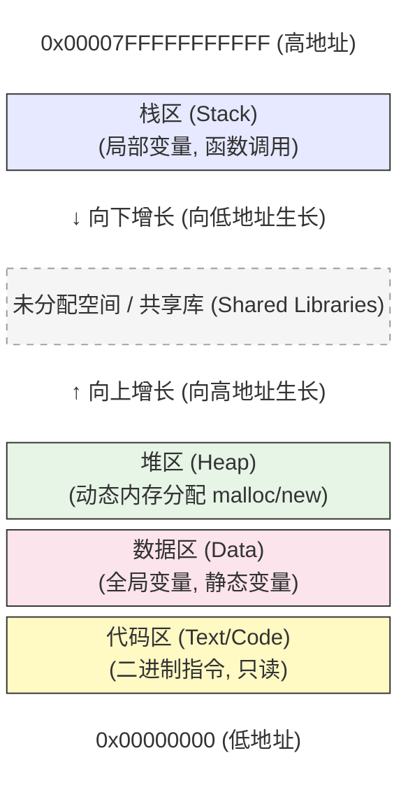

# Machine-Level Programming V: Advanced Topics

# Memory Layout
## x86-64 Linux Memory Layout

- ~={green}**Stack**=~
	- Runtime stack (8MB limit)
	- E.g., local variables
- ~={green}**Heap**=~
	- Dynamically allocated as needed
	- When call malloc(), calloc(), new()
- ~={green}**Data**=~
	- Statically allocated data
		- E.g., global vars, `static` vars, string constants
- ~={green}**Text / Shared Libraries**=~
	- Executable machine instructions
	- Read-only


- 虽然 CPU 的寄存器是 64 位的，但目前主流的处理器（如 Intel/AMD）在物理硬件上并没有连接全部 64 根地址线，而是只实现了 ~={orange}**48 位**=~ 虚拟地址
- 因为用户空间的地址最高位**必须固定为 0**，那么剩下的可以自由变动的位数就只有 **47 位** 了（从 bit 0 到 bit 46）
- $$用户空间大小 = 2^{47} \text{ 字节} = 128 \text{ TB}$$
- 而若第47位是1，则地址属于~={yellow}**内核空间**=~

### Brief Introduction

#### Stack
- 在常用的系统上，栈的大小是8MB
	- 一旦访问一个超出该值的栈，就会产生`segmentation fault`

#### `ulimit -a`

```ubuntu
cedri@ggw:~$ ulimit -a
real-time non-blocking time  (microseconds, -R) unlimited
core file size              (blocks, -c) 0
data seg size               (kbytes, -d) unlimited
scheduling priority                 (-e) 0
file size                   (blocks, -f) unlimited
pending signals                     (-i) 30905
max locked memory           (kbytes, -l) 65536
max memory size             (kbytes, -m) unlimited
open files                          (-n) 10240
pipe size                (512 bytes, -p) 8
POSIX message queues         (bytes, -q) 819200
real-time priority                  (-r) 0
{red}stack size                  (kbytes, -s) 8192
cpu time                   (seconds, -t) unlimited
max user processes                  (-u) 30905
virtual memory              (kbytes, -v) unlimited
file locks                          (-x) unlimited
```
- 大小确如老师所说
#### Others
- `text`（文本段）用于存放可执行区域

- `data`用来存放程序开始时分配的数据

- `heap`用来存放`malloc`或相关的函数申请的变量
	- 它们会动态变化
	- 若不`free`就会越来越大

- `shared libraries`同样用来存放代码
	- 其存储的是类似`printf`和`malloc`这样的~={purple}库函数=~
	- library code被存储在磁盘上
	- 程序开始执行之初它们被加载到程序当中，称之为“动态加载”
	- dynamic linking

### Memory Allocation Example

```C
char big_array[1L<<24];    /* 16 MB */
char huge_array[1L<<31];   /* 2 GB */

int global = 0;

int useless() { return 0; }

int main ()
{
    void *p1, *p2, *p3, *p4;
    int local = 0;
    p1 = malloc(1L << 28); /* 256 MB */
    p2 = malloc(1L << 8);  /* 256  B */
    p3 = malloc(1L << 32); /* 4 GB */
    p4 = malloc(1L << 8);  /* 256  B */
    /* Some print statements ... */
}
```

# Buffer Overflow

## Recall: Memory Referencing Bug Example

```C
typedef struct {
    int a[2];
    double d;
} struct_t;

double fun(int i) {
    volatile struct_t s;
    s.d = 3.14;
    s.a[i] = 1073741824; /* Possibly out of bounds */
    return s.d;
}
```

- `fun(0) -> 3.14`
    
- `fun(1) -> 3.14`
    
- `fun(2) -> 3.1399998664856`
    
- `fun(3) -> 2.00000061035156`
    
- `fun(4) -> 3.14`
    
- `fun(6) -> Segmentation fault`~={yellow}已经越过了整个结构体`s`的领地=~

- **C 语言不检查数组越界**：它给你极大的自由，也给了你写出 Bug 的无限可能。
    
- **内存是连续的**：越界不仅仅是写错数据，它会像“多米诺骨牌”一样破坏掉内存布局中紧随其后的任何东西。

## String Library Code

### Implementation of Unix function `gets()`

```C
/* Get string from stdin */
char *gets(char *dest)
{
	int c = getchar();
	char *p = dest;
	while (c != EOF && c != '\n') {
		*p++ = c;
		c = getchar();
	}
	*p = '\0';
	return dest;
}
```
- No way to specify limit on number of characters to read
- 缺少一种参数来告诉这个函数什么时候该结束
#### Similar problems with other library functions

- `strcpy, strcat`: Cpoy strings of arbitrary length
- `scanf, fscanf, sscanf`, when given `%s` conversion specific

## Vulnerability

### Vulnerable Buffer Code

```C
// Echo Line
void echo()
{
	char buf[4];    // Way too small!
	gets(buf);
	puts(buf);
}

void call_echo() {
	echo();
}
```
- 23个字符时可行（还要加上一个`'\0'`）
- 24个字符时`segmentation fault`
- 为什么是24和25？
	- 观察（反）汇编代码：
```Assembly
00000000004006cf <echo>:
  4006cf:    48 83 ec 18              sub    $0x18,%rsp
  4006d3:    48 89 e7                 mov    %rsp,%rdi
  4006d6:    e8 a5 ff ff ff           callq  400680 <gets>
  4006db:    48 89 e7                 mov    %rsp,%rdi
  4006de:    e8 3d fe ff ff           callq  400520 <puts@plt>
  4006e3:    48 83 c4 18              add    $0x18,%rsp
  4006e7:    c3                       retq
```
```Assembly
call_echo:
  4006e8:    48 83 ec 08              sub    $0x8,%rsp
  4006ec:    b8 00 00 00 00           mov    $0x0,%eax
  4006f1:    e8 d9 ff ff ff           callq  4006cf <echo>
  4006f6:    48 83 c4 08              add    $0x8,%rsp
  4006fa:    c3                       retq
```

在x86-64的System V ABI里：

- 执行`call`之前，`%rsp`必须是~={cyan}**16字节对齐**=~
- `call`会压入**8字节返回地址**
- 故函数入口时`%rsp % 16 == 8`
- 编译器需要通过`sub %rsp, X`来~={cyan}恢复对齐=~

调用函数时，需要：
- 栈 16 字节对齐
- 有些情况下需要~={yellow}额外 spill 空间=~

### Buffer Overflow Stack

当我输入23以上的字符时，我将破坏返回地址的字节表示

### Code Injection Attacks

<div style="background-color: #f8f9fa; padding: 20px; border-radius: 8px; color: #333; font-family: sans-serif; max-width: 500px; margin: 10px auto; border: 1px solid #ddd;">
    
    <div style="text-align: center; font-weight: bold; margin-bottom: 15px; font-size: 16px;">
        Stack after call to <code style="background: #eee; padding: 2px 4px; border-radius: 4px;">gets()</code>
    </div>

    <div style="display: flex; align-items: stretch; justify-content: center;">
        
        <div style="display: flex; flex-direction: column; justify-content: flex-end; padding-right: 10px; text-align: right; font-size: 13px; min-width: 100px;">
            <div style="margin-bottom: 60px;">data written<br>by <code>gets()</code></div>
            <div style="font-weight: bold; height: 30px; display: flex; align-items: center; justify-content: flex-end;">B →</div>
            <div style="height: 60px;"></div>
        </div>

        <div style="width: 140px; border: 2px solid #000; background: #fff; display: flex; flex-direction: column;">
            <div style="height: 80px; border-bottom: 2px solid #000; display: flex; align-items: center; justify-content: center;">P frame</div>
            <div style="height: 35px; border-bottom: 2px solid #000; padding-left: 8px; display: flex; align-items: center; background: #fff; font-weight: bold;">B</div>
            <div style="height: 70px; border-bottom: 2px solid #000; padding-left: 8px; display: flex; align-items: center; background: #c5cae9;">pad</div>
            <div style="height: 60px; border-bottom: 2px solid #000; padding-left: 8px; display: flex; align-items: center; background: #9fa8da;">exploit<br>code</div>
            <div style="height: 50px; background: #e8eaf6;"></div>
        </div>

        <div style="display: flex; flex-direction: column; padding-left: 10px; font-size: 13px;">
            <div style="height: 80px; display: flex; align-items: center; font-weight: bold;"> P stack frame</div>
            <div style="height: 165px; display: flex; align-items: center; font-weight: bold;"> Q stack frame</div>
        </div>

    </div>
</div>


- `gets()`函数~={red}**非常危险**=~，因为不检查输入字符串的长度
- **攻击发生：** 攻击者构造了一个特殊的输入字符串：

1. **Exploit Code（恶意代码）：** 字符串的前半部分是攻击者想要运行的机器指令（比如开启一个远程控制端口）
    
2. **Pad（填充物）：** 中间填充一些无用字符，直到填满 `buf` 并到达存放“返回地址”的位置
    
3. **Overwrite（覆盖）：** 最关键的一步！攻击者用 **B 地址**（即 `buf` 的起始地址）覆盖了原来的 **A 地址**

## Avoid Overflow

### 1. For example, use library routines that limit string lengths

- `fgets` instead of `gets`
- `strncpy` instead of `strcpy`
- Don't use `scanf` with `%s` conversion specification
	- Use `fgets` to read the string
	- Or use `%ns` where `n` is a ~={green}**suitable integer**=~

### 2. 栈随机化

- 每次程序启动，操作系统都会在栈的起始位置随机加上一个“偏移量”（Offset），这意味着`buf`的地址每次都在变
- 为了让黑客猜不到，随机化的位（Entropy）通常在16到30位之间，这意味着栈顶的位置可能在几MB甚至几GB的范围浮动

### 3. Stack Canaries can help
栈金丝雀

- Idea
	- Place special value ("canary") on stack just beyond buffer
	- Check for corruption before exiting function
- GCC Implementation
	- `-fstack-protector`
	- Now the defaulr (disabled earlier)

- 当一个函数开始执行时，编译器会自动在栈帧里的**局部变量**（比如你的 `buf[64]`）和**返回地址**之间，插入一个随机生成的数值

- 这个数值就是“金丝雀”。这个值通常在程序启动时生成，并存储在一个安全的地方（比如段寄存器 `gs` 或 `fs` 指向的内存）

- 若攻击者想要修改掉返回地址，由于栈是连续的，他必须先横扫过这个金丝雀位置

- 在执行`ret`之前，系统会增加一步操作，即~={yellow}**取回刚才埋进去的值，和原始值比对**=~
- 若数值变了，程序就会意识到自己正受到攻击
	- 为保护系统不受攻击，程序会立即崩溃并报错
		- 通常是`Stack smashing detected`

#### Protected Buffer Disassembly

echo:
```Assembly
echo:
  40072f:  sub     $0x18,%rsp
  400733:  mov     %fs:0x28,%rax
  40073c:  mov     %rax,0x8(%rsp)
  400741:  xor     %eax,%eax
  400743:  mov     %rsp,%rdi
  400746:  callq   4006e0 <gets>
  40074b:  mov     %rsp,%rdi
  40074e:  callq   400570 <puts@plt>
  400753:  mov     0x8(%rsp),%rax
  400758:  xor     %fs:0x28,%rax
  400761:  je      400768 <echo+0x39>
  400763:  callq   400580 <__stack_chk_fail@plt>
  400768:  add     $0x18,%rsp
  40076c:  retq
```

#### Setting Up Canary

<div style="background-color: white; padding: 30px; font-family: 'Segoe UI', Arial, sans-serif; color: black; line-height: 1.2;">
    
    <div style="font-size: 32px; font-weight: bold; margin-bottom: 5px;">Setting Up Canary</div>
    <div style="color: #A52A2A; font-style: italic; font-weight: bold; font-size: 18px; margin-bottom: 20px;">Before call to gets</div>

    <div style="display: flex; align-items: flex-start; gap: 40px;">
        
        <div style="display: flex; flex-direction: column; align-items: flex-start;">
            <div style="width: 180px; border: 2.5px solid black; border-bottom: none; background-color: white;">
                
                <div style="height: 90px; border-bottom: 2.5px solid black; display: flex; flex-direction: column; justify-content: center; align-items: center; text-align: center; font-weight: bold; font-size: 18px;">
                    <div>Stack Frame</div>
                    <div>for <span style="font-family: monospace;">call_echo</span></div>
                </div>

                <div style="height: 70px; border-bottom: 2.5px solid black; display: flex; flex-direction: column; justify-content: center; align-items: center; text-align: center; font-size: 17px;">
                    <div>Return Address</div>
                    <div>(8 bytes)</div>
                </div>

                <div style="height: 50px; background-color: #E8E8FF; border-bottom: 2.5px solid black;"></div>

                <div style="height: 70px; background-color: #C0C0FF; border-bottom: 2.5px solid black; display: flex; flex-direction: column; justify-content: center; align-items: center; font-size: 17px;">
                    <div>Canary</div>
                    <div>(8 bytes)</div>
                </div>

                <div style="height: 40px; display: flex; border-bottom: 2.5px solid black;">
                    <div style="flex: 1; border-right: 1px solid black; display: flex; align-items: center; justify-content: center; font-family: monospace; font-weight: bold;">[3]</div>
                    <div style="flex: 1; border-right: 1px solid black; display: flex; align-items: center; justify-content: center; font-family: monospace; font-weight: bold;">[2]</div>
                    <div style="flex: 1; border-right: 1px solid black; display: flex; align-items: center; justify-content: center; font-family: monospace; font-weight: bold;">[1]</div>
                    <div style="flex: 1; display: flex; align-items: center; justify-content: center; font-family: monospace; font-weight: bold;">[0]</div>
                </div>
            </div>

            <div style="display: flex; align-items: center; margin-top: 8px; font-family: monospace; font-size: 18px; font-weight: bold;">
                <span>buf</span>
                <span style="margin: 0 15px; font-size: 24px;">&larr;</span>
                <span>%rsp</span>
            </div>
        </div>

        <div style="background-color: #FFF9D6; border: 1px solid #999; padding: 20px; min-width: 450px; box-shadow: 2px 2px 5px rgba(0,0,0,0.1); border-radius: 2px;">
            <pre style="margin: 0; font-family: 'Courier New', Courier, monospace; font-size: 19px; line-height: 1.4; color: black; background: transparent; border: none;">
<span style="color: #A52A2A; font-style: italic; font-weight: bold;">/* Echo Line */</span>
<span style="font-weight: bold;">void echo()</span>
{
    <span style="font-weight: bold;">char buf[4];  </span><span style="color: #A52A2A; font-style: italic; font-weight: bold;">/* Way too small! */</span>
    <span style="font-weight: bold;">gets(buf);</span>
    <span style="font-weight: bold;">puts(buf);</span>
}</pre>
        </div>

    </div>
</div>


# Unions

## Union Allocation

- Allocate according to largest element
- Can only use one field at a time

- 声明和`struct`看起来非常像

```C
#include <stdio.h>

// 联合体定义：所有成员共享同一块 8 字节的内存
union U1 {
    char c;       // 1 byte
    int i[2];     // 8 bytes (2 * 4)
    double v;     // 8 bytes
} *up;

// 结构体定义：成员依次排列，包含填充字节以对齐内存
struct S1 {
    char c;       // 1 byte (+ 3 bytes padding)
    int i[2];     // 8 bytes
    // 这里可能还会有 4 bytes 的 padding，取决于 double 的对齐要求
    double v;     // 8 bytes
} *sp;

int main() {
    printf("Union U1 size: %lu bytes\n", sizeof(union U1));   // 通常为 8
    printf("Struct S1 size: %lu bytes\n", sizeof(struct S1)); // 通常为 24 (取决于对齐)
    return 0;
}
```

### 内存布局对比图解

|**特性**|**联合体 (Union)**|**结构体 (Struct)**|
|---|---|---|
|**起始地址**|`&up->c == &up->i[0] == &up->v`|每个成员有独立的起始地址|
|**内存重叠**|**完全重叠**。所有成员共用空间。|**互不重叠**。每个成员拥有专属空间。|
|**主要用途**|节省空间，或实现“伪多态”（不同方式解释同一段二进制数据）。|将相关的不同类型数据打包在一起。|

### 联合体是一种切换类型并得到~={yellow}不同的位表示形式=~的技术

