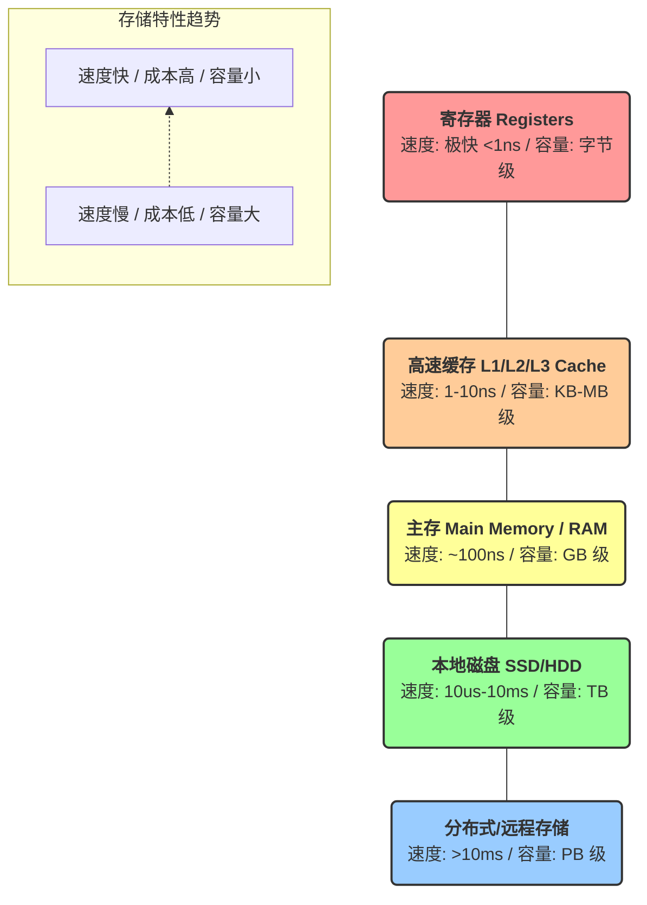
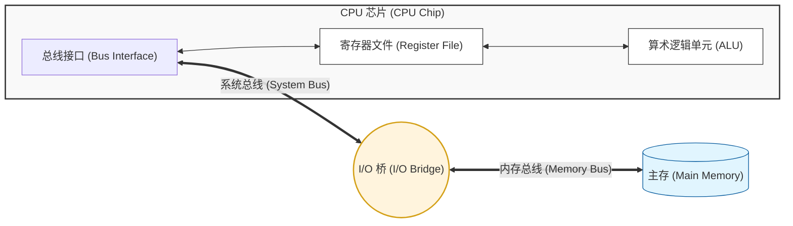
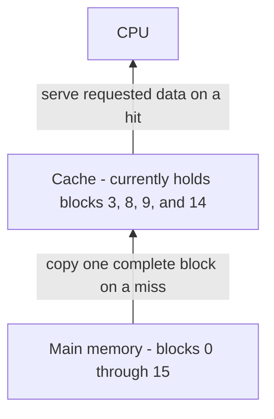

[[Lecture 11#Storage technologies and trends]]
[[#Locality of reference]]
[[#Caching in the memory hierarchy]]
# The Memory Hierarchy
探寻存储器层次结构是怎么构建的
目标是高层次理解



# Storage technologies and trends

## Random-Access Memory (RAM)
### Key features
- ~={red}RAM=~ is traditionally packaged as a chip
- Basic storage unit is normally a ~={red}cell=~ (one bit per cell)
- Multiple RAM chips form a memory

### RAM comes in two varieties:
- SRAM (Static RAM)
- DRAM (dynamic RAM)

- 区分：根据~={cyan}存储单元实现方式=~
#### SRAM vs DRAM Summary

| **特性**   | **每比特晶体管数 (Trans. per bit)** | **访问时间 (Access time)** | **是否需要刷新 (Needs refresh?)** | **Needs EDC?** | **Cost** | **Applications**                        |
| -------- | ---------------------------- | ---------------------- | --------------------------- | -------------- | -------- | --------------------------------------- |
| **SRAM** | 4 或 6                        | 1X                     | 否 (No)                      | 可能 (Maybe)     | 100X     | 高速缓存 (Cache memories)                   |
| **DRAM** | 1                            | 10X                    | 是 (Yes)                     | 是 (Yes)        | 1X       | 主存 (Main memories), 帧缓冲 (frame buffers) |
- DRAM 需要插着电使用
	- 若不插电，它会丢失电荷，也就是丢失保存的信息
	- 插电时不用刷新

- SRAM 更加可靠

- 但它们都是 volatile memories (易失的)

## Nonvolatile Memories (非易失性存储器)
- 即使断电也可以保留信息

- 它们之中很多被称为~={cyan}只读内存=~
	- Read-only memory (~={red}ROM=~): programmed during production
- Programmable ROM (~={red}PROM=~): can be programmed once
- Eraseable PROM (~={red}EPROM=~): can be bulk erased (UV, X-Ray)
- Electrically eraseable PROM (~={red}EEPROM=~): electronic erase capability
- Flash memory: EEPROMs, with partial (block-level) erase capability
	- Wears out after about 100,000 erasings
	- 可以删除闪存上面的存储块，十万次擦除之后就会磨损

### Uses for Nonvolatile Memories
- Fileware programs stored in a ROM (BIOS, controllers for disks, network cards, graphics accelerators, security subsystems, ...)
- Solid state disks
- Disk caches

### History

- 以前，很多早期 ROM 只能~={cyan}在其芯片生产期间被硬编码一次=~
- 如今，ROM 的编程、删除方式都有所改进
	- So they can be reprogrammed

## Traditional Bus Structure Connecting CPU and Memory
Bus: 总线

- A ~={red}**bus**=~ is a collection of parallel wires that carry address, data, and control signals
	- 一组并行的导线，负责在各个组件之间传递地址、数据和控制信号
		- 地址总线
		- 数据总线
		- 控制总线
- Buses are typically shared by multiple devices



### Register File
所谓寄存器文件：
- 很多个寄存器集成在一起组成的硬件模块

### I/O Bridge
所谓 I/O 桥：
- 它的存在就是为了让 CPU 、内存和各种外部设备（如硬盘、显卡、键盘）能~={purple}**互相通信**=~
- 而本来这些组件在速度、电压、协议等方面迥然不同
	- I/O 桥即负责~={yellow}**协议转换、速度缓冲、路由转发**=~
- 早期主板上 I/O 桥通常由~={yellow}两块大芯片=~组成：
#### Northbridge
- 靠近 CPU
- 连接高速设备
#### Southbridge
- 远离 CPU
- 连接低速设备

### Memory Read Transaction

~={red}Load operation=~: `movq A, %rax`
1. CPU places address A on the memory bus
2. Main memory reads A from the memory bus, retrieves word x, and places it on the bus
### Memory Write Transaction

~={red}Store operation=~: `movq %rax, A`
1. CPU places address A on bus. Main memory reads it and waits for the corresponding data word to arrive
2. CPU places data word y on the bus
3. Main memory reads data word y from the bus and stores it at address A

## Disk Geometry
- Disks consist of ~={yellow}**platters**=~(盘面), each with two~={green} **surfaces**=~(表面)
- Each ~={green}**surface**=~ consists of concentric rings(同心圆) called~={cyan} **tracks**=~(磁道)
- Each ~={cyan}**track**=~ consists of ~={blue}**sectors**=~(扇区) separated by gaps
	- 扇区存储着数据，每个扇区存储==512 个字节==

### Disk Capacity

- **~={orange}Capacity=~**: maximum number of bits that can be stored
	- Vendors(供应商) express capacity in units of gigabytes (GB), where 1 GB = 10$^9$ Bytes
- Capacity is determined by these technology factors:
	- ==Recording density== (bits/in): number of bits that can be spueezed into a 1 inch segment of a track
	- ==Track density== (tracks/in): number of tracks that can be squeezed into a 1 inch radial  segment
	- ==Areal density== (bits/in2): product of recording and track density

#### Computing Disk Capacity

~={yellow}**~={red}Capacity = (# bytes/sector) $\times$ (avg. # sectors/track) $\times$ (# tracks/surface) $\times$ =~**=~
~={red}**(# surfaces/platter) $\times$ (# platters/disk)** =~

# Locality of reference
访问的局部性
- 程序在执行时，~={cyan}**所访问的指令或数据往往呈现出“成群结队”的特征**=~，而不是随机分布在内存中的

## Locality to the rescue!

#### The key to bridging this CPU-Memory gap is a fundamental property of computer programs known as ~={red}locality=~
它弥合内存和 CPU 之间的差距

## Locality

- ==Principle of Locality==: Programs tend to use data and instructions with addresses near or equal to those they have used recently

### Temporal Locality
时间局部性
- Recently referenced items are likely to be referenced again in the near future

### Spatial Locality
空间局部性
- Items with nearby addresses tend to be referenced close together in time

### Example1

```C
sum = 0;
for (i = 0; i < n; i++)
	sum += a[i];
return sum;
```
- ~={yellow}**Data references**=~
	- References array elements in succession
	- Reference variable `sum` each iteration
- ~={yellow}**Instruction references**=~
	- Reference instructions in sequence
	- Cycle through loop repeatedly

## Qualitative Estimates of Locality

作为程序员，要能够对一段代码的局部性优良作~={green}**定性的判断**=~

如：
```C
for (i = 0; i < M; i++)
	for (j = 0; j < N; j++)
		sum += a[i][j]; 
```
这个非常不错！⬆️

但：
```C
for (i = 0; i < M; i++)
	for (j = 0; j < N; j++)
		sum += a[j][i]; 
```
这个相比于上一个~={red}**慢一个数量级**=~！

### Example2

三维数组：
```C
// a[M][N][N]
for (i = 0; i < M; i++)
	for (j = 0; j < N; j++)
		for (k = 0; k < N; k++)
			sum += a[i][j][k];
```
此即最佳写法！

# Caching in the memory hierarchy

将由[[Lecture 12]]详细介绍！

## Caches

- ~={red}**Cache:**=~ A smaller, faster storage device that acts as a staging area for a subset of the data in a larger, slower device

- Fundamental idea of a memory hierarchy:
	- For each $k$, the faster, smaller device at level $k$ serves as a cache for the larger, slower device at level $k+1$
		- 比如：可以把主存当成存储在磁盘的数据的缓存

- Why do memory hierarchies work?
	- Because of locality, programs tend to access the data at level $k$ ==more often== than they access at level $k+1$ 
	- Thus, the storage at level $k+1$ can be slower, and thus larger and cheaper per bit

- ~={red}**Big Idea:**=~ The memory hierarchy creates a large pool of storage that costs as much as the cheap storage near the bottom, but that serves data to programs at the rate of the fast storage near the top

## General Cache Concepts

- 在各种缓存中都有某种~={cyan}**传输单元**=~
	- 在层级之间来回拷贝



The cache is smaller, faster, and more expensive per bit. It stores only a subset of the fixed-size blocks in the larger, slower memory; transfers between the two levels happen one complete block at a time.

### Hit: 命中

1. 假设 CPU 需要某个块中的数据（比如 14）
	- 现在缓存内有这个块，因此可以直接返回——我们称之为~={red}**缓存命中**=~（cache hit）
	- ~={green}THIS IS GOOD!=~
	- 相比于去主存中找，直接在缓存中找到的速度快很多

2. 相反的情况：~={blue}**缓存不命中**=~（cache miss）
	- 比如 CPU 需要 12
	- 但在缓存中查无此项
		- 只好去主存中取出第 12 块
		- 复制到高速缓存中
		- 然后返回给 CPU

### Types of Cache Misses

- ~={red}**Cold miss**=~ / Compulsory miss
	- Cold misses occur because the cache is empty
	- 数据第一次被访问，这是不可避免的

- ~={red}**Conflict miss**=~
	- Most caches limit blocks at level $k+1$ to a small subset (sometimes a singleton) of the block positions at level $k$
		- E.g., Block i at level k+1 must be placed in block (i mod 4) at level k
			- 上例属于~={cyan}映射算法=~
	- Conflict misses occur when the level k cache is large enough, but multiple data objects all map to the same level k block
		- E.g., Referencing blocks 0, 8, 0, 8, 0, 8, ... would miss every time

	- 这时往往可以说：缓存明明还没满！

- ~={red}**Capacity miss**=~
	- Occurs when the set of active cache blocks (working set) is larger than the cache